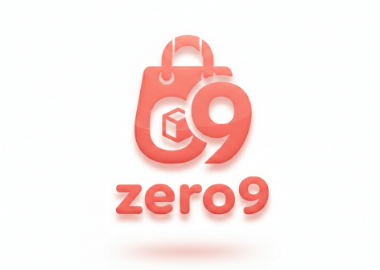

# <b>ZERO9 공동구매 플랫폼</b>


## "흩어진 공구를 한곳에" 
### 인플루언서 기반 공동구매 정보를 한 곳에 모으는 통합 플랫폼

    Zero9 Platform은 인플루언서 공동구매 시장의 정보 불균형을 해결하기 위해
    대규모 트래픽 환경에서도 안정적으로 동작하도록 설계된 통합 공구 탐색·결제 플랫폼입니다.
    
    단순 정보 제공을 넘어,
    사용자는 상품 단위로 여러 공구를 비교하고 플랫폼 내에서 직접 주문 및 결제까지 수행할 수 있습니다.
    또한 확장 가능한 아키텍처 위에서 실시간 집계, 검색 분리, 캐시 전략을 통해 성능과 데이터 정합성을 동시에 확보했습니다.

---

## 프로젝트 핵심 목표
### 1) 대규모 트래픽 대응 및 동시성 제어
    • Redis ZSet 기반 원자 연산으로 DB write 병목 제거
    • RabbitMQ 비동기 구조로 요청 흐름과 후처리 분리
    • Snapshot 구조로 실시간 집계 데이터 주기적 영속화
    • Local(Caffeine) + Remote(Redis) 2단계 캐시 전략 적용

### 2) 검색 및 성능 최적화
    • LIKE Full Scan 제거 → Elasticsearch Multi-match 전환
    • 실시간 데이터와 영속 통계 데이터 분리
    • Redis 기반 메모리 집계 + TTL 관리
    • Flyway 기반 스키마 버전 관리

### 3) 운영 및 확장성 확보
    • Docker 기반 컨테이너 배포
    • Stateless 인증 구조(JWT)로 수평 확장 고려
    • S3 외부 저장소 분리로 서버 경량화

### 4) 데이터 정합성 보장
    • MySQL 트랜잭션 기반 핵심 도메인 무결성 보장
    • Scheduler 기반 Snapshot 벌크 저장
    • Redis incrementScore 원자 연산으로 동시성 안전성 확보
    • Elasticsearch Backfill(Reindexing)으로 검색 데이터 일관성 유지

---

## Tech Stack
### Backend


---
### Database & Cache


---
### Search & Messaging


---
### Infra & DevOps


---
### Testing & Monitoring


---
### Collaboration & Tools


---

## KEY Summary
    • Scheduler 기반 주기적 공동구매 상품 게시물 상태 변경 확인/전환 및 Snapshot 저장
	• Redis ZSet 기반 실시간 집계 + 스냅샷 영속화 구조로 DB write 부하 최소화
	• Elasticsearch 기반 검색 계층 분리로 트랜잭션 DB와 검색 영역 완전 분리
	• RabbitMQ 비동기 처리로 요청 흐름과 후처리 로직 분리, 트래픽 집중 상황 대응
	• Local + Remote 2단계 캐시 전략으로 반복 조회 API 응답 속도 개선
	• JWT 기반 Stateless 구조와 S3 분리 저장으로 수평 확장 가능한 아키텍처 설계

---

## Package Structure
```text
com.zero9platform
├── common                       # 공통 설정 및 인프라 계층
│   ├── config                   # Security, Redis, RabbitMQ, Scheduler 등 설정
│   ├── aws.s3                   # AWS S3 파일 업로드 및 URL 관리
│   ├── entity                   # BaseEntity (공통 생성/수정/삭제 시간 관리)
│   ├── enums                    # 전역 공통 Enum 정의 (Role, Status, Period 등)
│   ├── exception                # CustomException, ExceptionCode, 전역 예외 처리
│   ├── util                     # 공통 유틸리티 (날짜, 문자열, 변환 로직 등)
│   ├── jwt                      # JWT 생성/검증, 필터, 인증/인가 처리
│   └── response                 # 공통 API 응답 포맷 (CommonResponse)
│
├── domain                       # 비즈니스 도메인 계층 (기능 단위 분리)
│   ├── auth                     # 로그인, 토큰 발급, Refresh Token 관리
│   ├── user                     # 일반 사용자 / 인플루언서 계정 관리
│   ├── admin                    # 관리자 전용 기능 및 통계 관리
│   ├── post                     # 범용 게시물 
│   ├── grouppurchase_post       # 공동구매 정보 게시물 (공구 일정 관리 포함)
│   ├── product_post             # 상품 판매 게시물 (실제 판매 기능)
│   ├── product_post_option      # 상품 옵션 및 옵션별 재고 관리
│   ├── product_post_favorite    # 상품 찜 등록/해제 및 랭킹 연동
│   ├── order                    # 주문 생성, 결제 처리, 트랜잭션 관리
│   ├── orderitem                # 주문 상세 정보 및 옵션 단위 수량 관리
│   ├── comment                  # 일반 게시물 댓글
│   ├── gpp_comment              # 공동구매 게시물 댓글
│   ├── gpp_follow               # 공동구매 일정 팔로우 기능
│   ├── searchLog                # 통합 검색 + 검색 로그 (Elasticsearch 기반)
│   ├── ranking                  # 실시간 랭킹 집계 (Redis ZSet + Snapshot 영속화)
│   └── activity_feed            # 실시간 활동 피드 (RabbitMQ 비동기 처리)
│
└── Zero9PlatformApplication  # Spring Boot 애플리케이션 실행 진입점
```

---

## ERD

<details>
<summary><b>👉펼치기</b></summary>


</details>

---

## 서비스 플로우

<details>
<summary><b>👉펼치기</b></summary>


</details>

---
## 아키텍처 플로우
<details>
<summary><b>👉펼치기</b></summary>

</details>

---

## 주요 기능
### 1) 인증/인가
	• JWT 기반 Stateless 인증 구조
	• Spring Security 기반 Role 권한 분리 (User / Influencer / Admin)
	• Access Token 기반 사용자 식별
	• 선택적 인증 API 지원 (비로그인 접근 허용 + 로그인 시 사용자 맞춤 응답)

    설계 의도 → 서버 세션을 사용하지 않는 무상태 구조로 확장성 확보

### 2) 주문/결제
	• 공동구매 일정 기반 주문 및 결제 처리
	• 트랜잭션 기반 데이터 무결성 보장
	• 재고 차감 시 동시성 제어를 위해 비관적 락(Pessimistic Lock) 적용

    설계 의도 → 단순 정보 플랫폼을 넘어 실제 구매가 가능한 커머스 구조 구현

### 3) 공동 구매 상품 판매 게시물
	• 인플루언서가 실제 판매 가능한 상품 게시물 등록
	• 상품 옵션 및 옵션별 재고 관리
	• 찜 기능과 랭킹 집계 연동
	• 판매 상태 관리 (진행/종료 등)

    설계 의도 → 정보 게시물과 분리된 독립적 커머스 도메인 설계로 확장성 확보

### 4) 공동 구매 홍보 게시물
	• 인플루언서가 공동구매 홍보 게시물 작성
	• 스케줄러를 통해 공구 일정 상태 자동 전환 (READY → DOING → DONE)
	• 댓글 기능 지원
	• 상품 판매 게시물과 정보 게시물 구조 분리

    설계 의도 → 커뮤니티 성격의 공구 홍보 도메인과 커머스 도메인 분리

### 5) 범용 게시물
	• 일반 회원/관리자를 위한 공지/문의 기능 제공
	• 게시물 종류는 공지,문의 게시물
	• 문의 게시물의 경우 작성자의 선택에 따라 비밀글로 설정 가능
	• 회원들의 문의 게시물 답변은 관리자가 댓글로 답변

    설계 의도 → 플랫폼을 이용하는 모든 사용자의 서비스 이용 불편 접수 기능 및 공지사항 제공 

### 6) 전체/개인 피드
	• 활동 기반 피드 집계
	• 활동 이벤트를 RabbitMQ 기반으로 비동기 처리
	• 요청 흐름과 후처리 로직을 분리하여 성능적 결합도 최소화
    
    설계 의도 → 사용자 참여 유도 및 플랫폼 체류 시간 증가 + 트래픽 집중 구간 대응

### 7) 랭킹
	• 인기 검색어 랭킹 / 공동구매 게시물 조회수 랭킹 / 상품판매 찜 랭킹
	• 기간별 랭킹 (일간 / 주간 / 월간)
	• Redis ZSet 기반 실시간 집계
	• Snapshot 기반 DB 영속화

    설계 의도 → 실시간 집계 데이터와 영속 통계 데이터 분리로 성능과 정합성 동시 확보

### 8) 통합 검색
	• 상품명 / 홍보게시물 내용 / 인플루언서 닉네임 기반 검색
	• Elasticsearch Multi-match 쿼리
	• 역색인 기반 전문 검색
	• Backfill(Reindexing) 수행
	• 검색 로그 수집 및 랭킹 연계
    
    설계 의도 → RDB LIKE 검색 한계 극복 및 대용량 검색 대응

---

## 기술적 고도화 의사결정
### 1) Docker Compose 기반의 인프라 표준화 및 배포 자동화
    배경
    • EC2 단일 서버 환경에서 애플리케이션, Redis, RabbitMQ, Elasticsearch 등 다수의 의존 서비스를 개별적으로 관리해야 하는 복잡성 존재
    
    문제
    • 서비스 간 기동 순서(예: DB 마이그레이션 후 앱 실행) 제어의 어려움과 환경 구성의 파편화로 인한 운영 불안정성
    
    해결
    • Docker Compose를 도입하여 전체 스택을 하나의 배포 단위로 정의. depends_on과 Healthcheck를 활용해 서비스 기동 순서를 강제하고 환경 구성을 표준화함
    
    결과
    • 단일 명령어로 전체 인프라 기동 및 재배포가 가능해졌으며, 초기 서비스 규모에 최적화된 안정적인 운영 환경 확보

### 2) Redis를 활용한 DB 부하 분산 및 시스템 가용성 확보
    배경
    • 서비스 성장으로 인해 읽기/쓰기 요청이 메인 RDB(MySQL)로 집중되어 성능 저하 발생

    문제
    • 피크 타임 시 DB I/O 부하 급증으로 인한 커넥션 풀 부족 및 응답 지연 발생. 특히 랭킹과 같이 계산 비용이 큰 데이터의 반복 조회가 자원 고갈의 주범으로 파악됨

    해결
    • 인메모리 캐싱 전략 도입. 조회 빈도가 높은 데이터는 Redis에 저장하고, 실시간성이 낮은 데이터는 스케줄러를 통해 배치로 DB에 반영하는 Write Back/Cache Aside 전략 채택
    
    결과
    • RDB의 직접적인 I/O를 획기적으로 낮추어 응답 속도 개선 및 시스템 안정성 확보

### 3) Elasticsearch 도입을 통한 검색 경험 및 아키텍처 고도화 (CQRS)

    배경
	• MySQL의 %LIKE% 방식은 데이터 증가 시 성능이 급격히 저하되며, 오타 및 불완전 키워드 대응 불가

    문제
	• 무거운 검색 쿼리가 주문·결제와 동일한 DB 자원을 점유하여, 검색 트래픽 폭증 시 핵심 매출 엔진인 결제 시스템까지 마비될 위험 존재

    해결
	• Elasticsearch 기반의 역색인(Inverted Index) 검색 도입 및 CQRS(명령과 조회의 책임 분리) 아키텍처 채택
	• Scoring & Boosting: 제목(Title)에 가중치를 부여하고 오타 보정 기능을 적용해 검색 정합성 고도화

    결과
	• 검색 응답 속도 약 17배 개선 및 검색 부하를 결제 트랜잭션으로부터 완전히 격리하여 서비스 가용성 극대화

### 4) RabbitMQ 기반 비동기 피드 시스템 고도화
    배경
	• 게시물 상태 변경 등 주요 활동 발생 시 사용자에게 실시간 피드를 전달하기 위해 기존에는 Spring @Async를 사용함

    문제
	• 메모리 기반 비동기 방식은 서버 장애 시 큐의 메시지가 유실될 위험이 크며, 피드 작업이 메인 애플리케이션 자원을 공유하여 핵심 비즈니스 로직(주문/결제) 성능에 간섭하는 강한 결합(Tight Coupling) 문제 발생

    해결
	• 메시지 브로커인 RabbitMQ를 도입하여 이벤트 발행과 처리를 완전히 분리(Decoupling). 메시지 영속성(Durability)과 응답 확인(Ack) 메커니즘 적용

    결과
	• 서버 장애 시에도 데이터 신뢰성을 보장하며, 트래픽 폭주 시 큐를 버퍼로 활용하여 시스템 부하를 유연하게 조절하는 고가용성 아키텍처 구축

### 5) Spring Scheduler를 통한 운영 자동화 및 일관성 확보
    배경
	• 공동구매 게시물의 진행 상태(READY → DOING → DONE) 관리가 관리자의 수동 작업에 의존함

    문제
	• 게시물 수 증가에 따른 운영 리소스 급증 및 수동 갱신 누락에 따른 정책 불일치(휴먼 에러) 발생

    해결
	• Spring Scheduler를 도입하여 매일 00:00에 자정 기준 날짜를 체크하고 게시물 상태를 자동 갱신하도록 설계

    결과
    • 관리자 수작업을 완전히 제거하여 운영 효율성을 높였으며, 대규모 데이터 증가에도 안정적으로 상태를 관리할 수 있는 확장성 확보

### 6) 비관적 락(Pessimistic Lock)을 이용한 재고 정합성 보장
    배경
    • 한정된 재고를 가진 공동구매 상품 특성상 특정 시점에 다수의 사용자가 동시에 구매를 시도함

    문제
    • 여러 트랜잭션이 동시에 재고를 수정하며 실제 재고보다 많은 주문이 생성되는 초과 판매(Over-selling) 및 데이터 불일치 리스크 발생

    해결
    • 재고는 충돌 가능성이 매우 높은 핵심 데이터(High Contention)로 판단하여 비관적 락(PESSIMISTIC_WRITE) 적용. DB 레벨에서 Row 단위 락을 유지하여 순차적 접근 보장

    결과
    • 동시 주문 상황에서도 재고 수량과 주문 수의 정합성을 100% 보장하며 구매 신뢰도 확보

---

## 성능 개선 및 아키텍처 최적화

<details>
<summary><b>1) Redis 캐시 도입을 통한 피드 조회 속도 개선</b></summary>

### Before – DB 직접 조회

9,480ms 
████████████████████████████████████████████████

- 약 500만 건 데이터 Join 및 실시간 COUNT(*)로 인해 평균 9.48초 지연
- 인덱스 최적화만으로는 구조적 한계 존재

### After – Redis Cache Aside 적용

28.55ms
█████████

- 인메모리 기반 조회 구조로 전환
- Cache Evict 전략 + 트랜잭션 연동으로 데이터 정합성 유지
    #### 약 332배 이상 응답 속도 개선
    #### DB 집계 구조 → 메모리 기반 조회 구조 전환

</details>

<details>
<summary><b>👆 K6 피드 대용량 트래픽 테스트 결과</b></summary>


</details>

---

<details>
<summary><b>2) Elasticsearch 도입을 통한 통합 검색 성능 최적화</b></summary>

### Before – &LIKE& 기반 Full Scan

871ms  
████████████████████████████████████████████████

- 검색어 변형에 대한 대응이 부족하여 원하는
  결과가 노출되지 않는 문제
- `%LIKE%` 기반 검색으로 기술적 고도화의 한계
- 데이터 증가 시 Full Scan 위험

### After – Elasticsearch Multi-match + CQRS 분리

51ms  
████

- 약 17배 성능 개선 및 검색 부하 결제 시스템으로부터 완전 격리
- 역색인(Inverted Index) 기반 전문 검색 및 형태소 분석 도입
- Scoring & Boosting: 제목(title^10) 가중치 부여로 검색 정합성 고도화
- 읽기(ES)와 쓰기(RDB) 저장소를 분리하는 CQRS 아키텍처 구현

  ## 약 17배 성능 개선
  ## 검색과 트랜잭션 DB 분리 성공

</details>

<details>

<summary><b>👆 K6 통합검색 대용량 트래픽 테스트 결과</b></summary>


</details>

---

<details>
<summary><b>3) Write-Behind 전략을 이용한 조회수 업데이트 최적화</b></summary>

### Before – 실시간 DB Update (V1)

46,191ms (1만 건 처리 기준) ████████████████████████████████████████████████

- 조회 발생 시마다 DB UPDATE 수행으로 인한 Row-Level Lock 경합 발생
- 인기 게시물 집중 시 전체 API 응답 성능 저하의 주범

### After – Redis 쓰기 캐싱 + Scheduler Bulk Update

1,930ms ████

- 성능 향상: 쓰기 처리 속도 약 24배 향상, TPS 2,300% 상승
- 최적화 전략: - 조회 발생 시 Redis 카운터만 즉시 증가 (Write-Behind)
- 스케줄러를 활용해 1분 주기 혹은 특정 임계치 도달 시 DB에 Bulk Update 수행
- N번의 쓰기 작업을 1번으로 압축하여 RDB Write 부하 구조적 제거

👉 **[K6 캐시 부하 테스트 결과 보기](./docs/performance-cache.md)**

</details>

---


<details>
<summary><b>4) Redis Remote Cache 기반 랭킹 시스템 구축</b></summary>

### Before – DB 기반 실시간 집계
2,140ms ████████████████████████████████████████████████

- 기간별(일간/주간/월간) 랭킹 조회 시 대량 데이터 정렬 부하 집중
- 트래픽 집중 구간에서 응답 지연 변동 폭 급증

### After – Redis ZSet 기반 실시간 집계
17ms ██

- 성능 향상: 반복 조회 API 응답 속도 안정화 및 DB 조회 부하 제거
- 최적화 전략: - Redis의 **Sorted Set(ZSet)**을 활용해 실시간 랭킹 자동 정렬
- Scheduler 기반 Snapshot 저장으로 영속 데이터(DB)와 실시간 데이터 분리

</details>

---

## 트러블 슈팅
<details>
<summary><b>1) Redis 도입 후 피드 성능 정체: DTO 역직렬화 실패 및 캐시 스탬피드</b></summary>

    현상: Redis 도입 후에도 응답 속도가 1s 이상 기록됨. 로그 확인 결과 Cache Hit가 발생하지 않고 모든 요청이 DB로 몰리는 병목 현상 발생
    원인: Jackson 라이브러리의 메커니즘 오해. DTO가 @RequiredArgsConstructor 기반의 불변 객체로 설계되어, 기본 생성자를 사용하는 Jackson의 역직렬화 과정에서 객체 복원에 실패함
    해결: DTO에 @NoArgsConstructor(access = AccessLevel.PROTECTED)를 추가하고 final 키워드를 제거하여 Jackson 친화적 구조로 개선
    조회 시점에 Redis 카운트를 직접 주입하는 Dynamic Binding 전략으로 로직 고도화
    결과: 평균 응답 속도 1,000ms+ → 10.53ms (약 100배 개선) 및 DB 부하 급감

    회고: "캐시의 존재보다 중요한 것은 유효성이다." 라이브러리의 내부 동작 방식(Reflection)을 깊이 이해하는 것이 성능 최적화의 핵심임을 체감함

</details>

<details>
<summary><b>2) 랭킹 데이터 정합성: 누적 데이터에 의한 신규 트렌드 반영 지연</b></summary>

    현상: 인기 랭킹이 현재 트렌드를 반영하지 못하고 과거의 누적 데이터(예: 허니버터칩)에 의해 고착화되어 플랫폼 신뢰도 저하
    원인: "인기"의 정의가 시간 가중치나 리셋 없는 단순 누적 기반으로 설계된 비즈니스 정책의 한계
    해결: 랭킹 KPI를 '누적'에서 '최신성(Recency)' 중심으로 재정의하여 일간/주간/월간 단위로 분리 
    Redis ZSet을 활용한 실시간 집계와 스케줄러 기반의 Snapshot 저장 구조를 통해 운영 안정성 확보
    결과: 사용자가 체감하는 현재 인기 트렌드와 랭킹 일치, 탐색 동선 및 구매 전환율 개선.
  
    회고: "랭킹은 기술이 아니라 '정의'가 만든다." 비즈니스 용어를 사용자 관점에서 재정의하는 설계의 중요성을 학습함.

</details>

<details>
<summary><b>3) 피드 비즈니스 로직 고도화: 100개의 노이즈를 1개의 핵심 신호로 압축</b></summary>

    현상: 특정 상품 주문 집중 시 개별 구매 피드가 리스트를 도배하여 가시성이 저하되고, 중요 알림이 하단으로 매몰되는 정보 과잉 발생
    원인: 주문 1건당 피드 1개를 생성하는 1:1 매핑 방식의 일차원적 알림 정책
    해결: 개별 피드 생성 대신 상품 ID 기준의 데이터 집계(Aggregation) 정책 도입
    Redis Atomic 연산으로 실시간 구매자 수를 카운팅하고, DB에는 상품당 1개의 요약 레코드만 유지하며 updatedAt을 갱신(Bump)하는 구조로 변경.
    결과: 정보 밀도 극대화로 스팸 현상 제거, "지금 100명이 주문 중!"이라는 **사회적 증거(Social Proof)**를 통한 구매 전환 유도 및 시스템 최적화.
  
    회고: "알림은 기록이 아니라 '신호'여야 한다." 데이터를 유저가 원하는 형태로 가공하고 요약하는 것이 진정한 UI/UX 개선임을 깨달음.

</details>

<details>
<summary><b>4) 리팩토링 후 비속어 필터 마비: 파일 시스템 경로 의존성 문제</b></summary>

    현상: 패키지 구조 변경 리팩토링 후 비속어 추가/삭제 API에서 NoSuchFileException 발생 및 필터링 기능 중단
    원인: 클래스 파일 위치에 의존적인 상대 경로 참조 방식 설계. 클래스 이동 시 리소스 탐색 경로가 완전히 유실됨
    해결: 애플리케이션 실행 루트(user.dir)를 기준점으로 삼는 경로 고정 전략 채택
    루트 파일 부재 시 클래스패스에서 기본 데이터를 복사해 생성하는 Fallback 로직 구현으로 초기 안정성 확보
    결과: 패키지 구조 변경에 무관한 파일 입출력 안정성 확보 및 실시간 비속어 업데이트 정합성 유지
    
    회고: "데이터의 주소는 코드의 위치로부터 독립되어야 한다." 시스템 구조가 변해도 흔들리지 않는 절대적 기준점 설계의 중요성을 학습함

</details>

<details>
<summary><b>5) Docker Compose 환경 내 서비스 기동 실패: 컨테이너 네트워크 격리</b></summary>

    현상: 컨테이너는 정상 실행되었으나 Spring Boot 애플리케이션이 Redis/RabbitMQ/ES 연결에 지속적으로 실패하는 장애 발생
    원인: 각 컨테이너의 독립된 네트워크 네임스페이스에 대한 이해 부족. 컨테이너 내부의 localhost는 자기 자신을 가리키기 때문임
    해결:  Docker Compose 네트워크 내 DNS 호스트명(서비스명) 기반 통신으로 전면 수정
    REDIS_HOST: redis, RABBITMQ_HOST: rabbitmq 등 서비스명으로 호스트 설정 변경
    결과: 멀티 컨테이너 환경에서 외부 서비스 정상 연결 확인 및 EC2 환경 배포 성공
    
    회고: "컨테이너 환경에서 localhost는 의심의 대상이다." 격리된 실행 단위의 특성과 네트워크 구조 이해가 인프라 안정성의 핵심임을 체감함

</details>

<details>
<summary><b>6) 배포 직후 기동 실패: Flyway 마이그레이션 실행 순서 문제</b></summary>

    현상: 배포 직후 Table not found, Validation failed 오류와 함께 애플리케이션 무한 재시작 발생
    원인: 애플리케이션 실행 시점에 DB 스키마가 아직 준비되지 않은 상태. 독립 컨테이너로 분리된 Flyway와 애플리케이션 간 실행 순서 미보장
    해결: Docker Compose의 depends_on에 condition: service_completed_successfully를 적용
    Flyway 컨테이너가 마이그레이션을 성공적으로 완료한 후에만 애플리케이션 컨테이너가 기동하도록 강제
    결과: 재배포 시 DB 관련 장애 완전 제거 및 배포 프로세스 안정화
    
    회고: "배포의 핵심은 코드가 아니라 '순서'다." 시스템 의존성을 코드로 명시하여 운영 안정성을 확보하는 법을 배움

</details>

---

## 역할 분담 및 협업 방식
### 1) Detail Role
| 이름  | 포지션  | 담당(개인별 기여점)                                                                                                          | Github 링크                       |
|------|-------|----------------------------------------------------------------------------------------------------------------------|---------------------------------|
| 최정윤 | 리더   | 주문/결제 도메인 설계 및 구현• 주문 생성 ~ 결제 완료 트랜잭션 흐름 설계• 재고 차감 동시성 제어 적용• 공구 일정 팔로우 기능 구현• Docker Compose 기반 EC2·RDS 배포 구조 설계    | [https://github.com/remnantcjy]                    |
| 정하륜 | 부리더  | 검색·랭킹·캐시 구조 설계 및 구현• Elasticsearch 기반 통합 검색 구조 설계• Redis ZSet 기반 랭킹 집계 구조 구현• Snapshot 영속화 전략 설계• 찜 기능 및 랭킹 연계 구조 설계 | [https://github.com/jyop1212hy] |
| 김규림 | 팀원   | 인증/인가 및 결제 연동 담당• JWT + Refresh Token 구조 구현• Spring Security Role 기반 권한 분리• 토스페이먼츠 PG 연동• 프론트엔드 UI 연동                | [https://github.com/kingyulim]                     |
| 김동욱 | 팀원   | 공동구매 게시물 및 스케줄러 담당• 공구 상태 자동 전환 스케줄러 구현• 게시물 도메인 설계 및 CRUD 구현• 공동구매 게시물 조회수 랭킹 일부 로직 지원• 발표 자료 정리                    | [https://github.com/BullGombo]                     |
| 정순관 | 팀원   | ZERO9NOW 및 일반 게시물 기능 구현• 활동 피드 구조 설계• 일반 게시물 도메인 구현• 노션 문서 관리 및 발표 자료 제작                                             | [https://github.com/uhk561]                       |

### 2) 협업 방식
    • 매일 스크럼을 통한 진행 상황 공유
    • 기능 단위 및 버전별로 브랜치 전략 사용
    • PR 기반 코드 리뷰 진행과 PR 승인자 2명 지정
    • Notion을 통한 정책 및 설계 문서 관리
    • 이슈 발생 시 즉시 공유 및 공동 해결
    • 팀 내 코드 컨벤션 통일 및 적용

---

### 3) Ground Rule
#### 문제 발생 시 즉시 공유
    • 장애 및 이슈 발생 시 지체 없이 공유하고 담당자와 협력하여 해결 방안을 도출

#### 정규 시간 외에도 적극적 소통 유지
    • 일정 준수를 위해 필요 시 추가 소통을 진행하며 문제 해결 우선

#### 적극적인 질문 문화
    • 궁금한 점이나 막힌 부분은 사소한 것이라도 즉시 물어보고 해결

#### 스크럼 중심 문제 해결
    • 매일 스크럼을 통해 진행 상황과 이슈를 공유하고 방향을 정렬

#### 상호 존중 기반 의사소통
    • 기술적 의견 충돌 시 논리 중심의 토론 진행
    • 개인 비판이 아닌 문제 해결 중심 커뮤니케이션 유지

#### 성장 중심 협업 문화
    • 개인의 실수나 미숙함을 지적하기보다 학습과 개선에 초점

---

## 성과 및 회고
### 1) 잘된 점
#### 기술 도입을 위한 기술이 아닌, 서비스 목적 중심의 기능 고도화 진행
    • "최신기술을 사용해봐야지" 가 아닌 서비스의 목적에 필요한 만큼 사용함
    • 개발을 하기전 서비스를 사용하는 사용자들의 관점에서 많은 고민과 논의를 통해 무분별한 개발을 최대한 막음

#### 유동적 일정 관리
    • 정해진 일정을 준수하기 위해 팀원간 업무와 내부 일정을 유동적으로 조절하여 팀원들의 컨디션을 유지

#### 문제 해결을 위한 수단
    • 문제가 생기거나 에러/버그 등을 해결 하기 위해 공식 문서, 블로그, AI 등 다양한 자료를 활용하여 해결

#### 서비스 확장
    • 초기 SA회의 깊이 있게 하여 초기 목표 였던 커뮤니티성격의 사이트 구현이 완료되어 주문/결제 기능까지 추가확장

### 2) 아쉬운 점
#### 프로젝트 초기 계획 논의 지연
    • 와이어프레임, 명세서 작성, 정책 사항 등에서 논의가 길어져서 실제 개발 시작시간이 지연됨

#### 시간 부족으로 일부 기능 미완성
    • 시간 부족으로 버전별로 추가적인 기능 확장이나 더 많은 고도화를 구현하지 못한점에 있어서 아쉬움이 남음

---

### 향후 계획
#### 기술적 고도화
    • 무중단 배포를 위한 추가적인 블루/그린배포 전략 도입 계획
    • 카카오 OAuth 2.0을 통한 인증 서비스 기능 추가

#### 추가 기능 개발
    • 데이터 분석 기능을 추가해 쿠폰 발급 및 사용 데이터를 기반으로 한 비즈니스 인사이트 제공
    • 공구 일정 팔로우 기능을 기반으로 사용자에게 일정 알림 기능 추가
    • 소켓 통신 기능을 추가하여 사용자에게 동적 피드백 경험 제공

