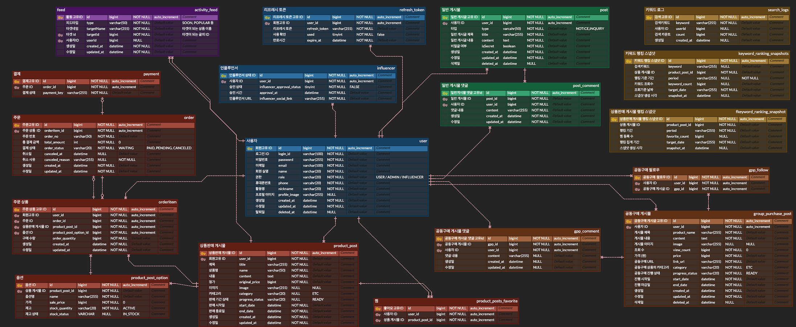
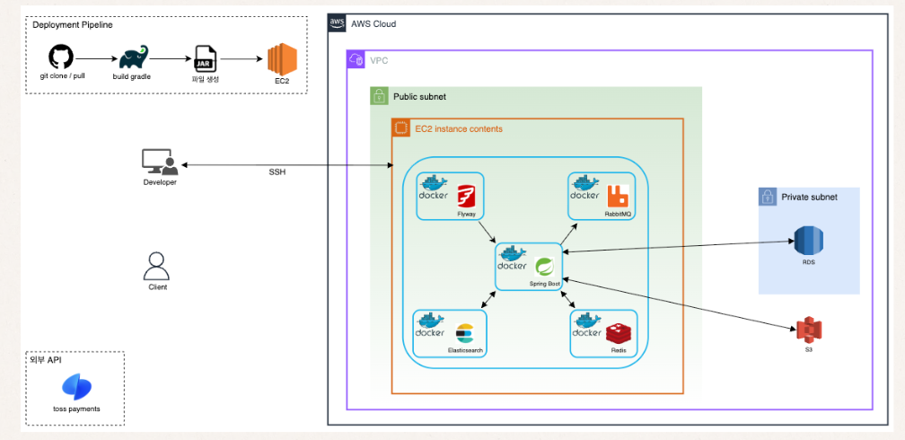
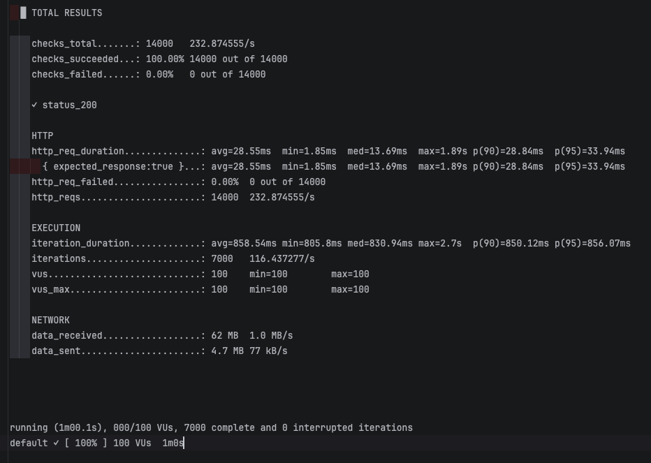
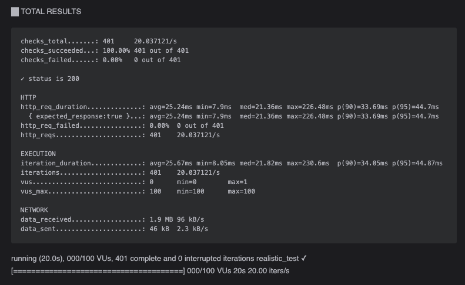

# <b>ZERO9 공동구매 플랫폼</b>


## "흩어진 공구를 한곳에" 
### 인플루언서 기반 공동구매 정보를 한 곳에 모으는 통합 플랫폼

Zero9 Platform</b>은 인플루언서 공동구매 시장의 정보 불균형을 해결하기 위해
대규모 트래픽 환경에서도 안정적으로 동작하도록 설계된 통합 공구 탐색·결제 플랫폼입니다.

단순 정보 제공을 넘어,
사용자는 상품 단위로 여러 공구를 비교하고 플랫폼 내에서 직접 주문 및 결제까지 수행할 수 있습니다.
또한 확장 가능한 아키텍처 위에서 실시간 집계, 검색 분리, 캐시 전략을 통해 성능과 데이터 정합성을 동시에 확보했습니다.

---

## 프로젝트 핵심 목표
### 1. 대규모 트래픽 대응 및 동시성 제어
- Redis ZSet 기반 원자 연산으로 DB write 병목 제거
- RabbitMQ 비동기 구조로 요청 흐름과 후처리 분리
- Snapshot 구조로 실시간 집계 데이터 주기적 영속화
- Local(Caffeine) + Remote(Redis) 2단계 캐시 전략 적용

### 2. 검색 및 성능 최적화
- LIKE Full Scan 제거 → Elasticsearch Multi-match 전환
- 실시간 데이터와 영속 통계 데이터 분리
- Redis 기반 메모리 집계 + TTL 관리
- Flyway 기반 스키마 버전 관리

### 3. 운영 및 확장성 확보
- Docker 기반 컨테이너 배포
- Stateless 인증 구조(JWT)로 수평 확장 고려
- S3 외부 저장소 분리로 서버 경량화

### 4. 데이터 정합성 보장
- MySQL 트랜잭션 기반 핵심 도메인 무결성 보장
- Scheduler 기반 Snapshot 벌크 저장
- Redis incrementScore 원자 연산으로 동시성 안전성 확보
- Elasticsearch Backfill(Reindexing)으로 검색 데이터 일관성 유지
---
## Tech Stack
### Backend


---
### Database & Cache


---
### Search & Messaging


---
### Infra & DevOps


---
### Testing & Monitoring


---
### Collaboration & Tools


---
## KEY Summary
    • Scheduler 기반 주기적 공동구매 상품 게시물 상태 변경 확인/전환 및 Snapshot 저장
	• Redis ZSet 기반 실시간 집계 + 스냅샷 영속화 구조로 DB write 부하 최소화
	• Elasticsearch 기반 검색 계층 분리로 트랜잭션 DB와 검색 영역 완전 분리
	• RabbitMQ 비동기 처리로 요청 흐름과 후처리 로직 분리, 트래픽 집중 상황 대응
	• Local + Remote 2단계 캐시 전략으로 반복 조회 API 응답 속도 개선
	• JWT 기반 Stateless 구조와 S3 분리 저장으로 수평 확장 가능한 아키텍처 설계
---
## Package Structure
```text
com.zero9platform
├── common                       # 공통 설정 및 인프라 계층
│   ├── config                   # Security, Redis, RabbitMQ, Scheduler 등 설정
│   ├── aws.s3                   # AWS S3 파일 업로드 및 URL 관리
│   ├── entity                   # BaseEntity (공통 생성/수정/삭제 시간 관리)
│   ├── enums                    # 전역 공통 Enum 정의 (Role, Status, Period 등)
│   ├── exception                # CustomException, ExceptionCode, 전역 예외 처리
│   ├── util                     # 공통 유틸리티 (날짜, 문자열, 변환 로직 등)
│   ├── jwt                      # JWT 생성/검증, 필터, 인증/인가 처리
│   └── response                 # 공통 API 응답 포맷 (CommonResponse)
│
├── domain                       # 비즈니스 도메인 계층 (기능 단위 분리)
│   ├── auth                     # 로그인, 토큰 발급, Refresh Token 관리
│   ├── user                     # 일반 사용자 / 인플루언서 계정 관리
│   ├── admin                    # 관리자 전용 기능 및 통계 관리
│   ├── post                     # 일반 게시물 (ZERO9NOW 등 커뮤니티 기능)
│   ├── grouppurchase_post       # 공동구매 정보 게시물 (공구 일정 관리 포함)
│   ├── product_post             # 상품 판매 게시물 (실제 판매 기능)
│   ├── product_post_option      # 상품 옵션 및 옵션별 재고 관리
│   ├── product_post_favorite    # 상품 찜 등록/해제 및 랭킹 연동
│   ├── order                    # 주문 생성, 결제 처리, 트랜잭션 관리
│   ├── orderitem                # 주문 상세 정보 및 옵션 단위 수량 관리
│   ├── comment                  # 일반 게시물 댓글
│   ├── gpp_comment              # 공동구매 게시물 댓글
│   ├── gpp_follow               # 공동구매 일정 팔로우 기능
│   ├── searchLog                # 통합 검색 + 검색 로그 (Elasticsearch 기반)
│   ├── ranking                  # 실시간 랭킹 집계 (Redis ZSet + Snapshot 영속화)
│   └── activity_feed            # 실시간 활동 피드 (RabbitMQ 비동기 처리)
│
└── Zero9PlatformApplication  # Spring Boot 애플리케이션 실행 진입점
```
---

## ERD

<details>
<summary><b>👉펼치기</b></summary>



</details>

---

## 서비스 플로우

<details>
<summary><b>👉펼치기</b></summary>


</details>

---
## 아키텍처 플로루
<details>
<summary><b>👉펼치기</b></summary>



</details>

---
## 주요 기능
### 1) 인증/인가
	• JWT 기반 Stateless 인증 구조
	• Spring Security 기반 Role 권한 분리 (User / Influencer / Admin)
	• Access Token 기반 사용자 식별
	• 선택적 인증 API 지원 (비로그인 접근 허용 + 로그인 시 사용자 맞춤 응답)
설계 의도 → 서버 세션을 사용하지 않는 무상태 구조로 확장성 확보

### 2) 주문/결제
	• 공동구매 일정 기반 주문 및 결제 처리
	• 트랜잭션 기반 데이터 무결성 보장
	• 재고 차감 시 동시성 제어를 위해 비관적 락(Pessimistic Lock) 적용
설계 의도 → 단순 정보 플랫폼을 넘어 실제 구매가 가능한 커머스 구조 구현

### 3) 공동 구매 상품 게시물
	• 인플루언서가 실제 판매 가능한 상품 게시물 등록
	• 상품 옵션 및 옵션별 재고 관리
	• 찜 기능과 랭킹 집계 연동
	• 판매 상태 관리 (진행/종료 등)
설계 의도 → 정보 게시물과 분리된 독립적 커머스 도메인 설계로 확장성 확보

### 4) 공동 구매 홍보 게시물
	• 인플루언서가 공동구매 홍보 게시물 작성
	• 스케줄러를 통해 공구 일정 상태 자동 전환 (READY → DOING → DONE)
	• 댓글 기능 지원
	• 상품 판매 게시물과 정보 게시물 구조 분리
설계 의도 → 커뮤니티 성격의 공구 홍보 도메인과 커머스 도메인 분리

### 5) 실시간 공동/개인 피드 알림
	• 활동 기반 피드 집계
	• 활동 이벤트를 RabbitMQ 기반으로 비동기 처리
	• 요청 흐름과 후처리 로직을 분리하여 성능적 결합도 최소화
설계 의도 → 사용자 참여 유도 및 플랫폼 체류 시간 증가 + 트래픽 집중 구간 대응

### 6) 랭킹
	• 인기 검색어 랭킹 / 공동구매 게시물 조회수 랭킹 / 찜 랭킹
	• 기간별 랭킹 (일간 / 주간 / 월간)
	• Redis ZSet 기반 실시간 집계
	• Snapshot 기반 DB 영속화
설계 의도 → 실시간 집계 데이터와 영속 통계 데이터 분리로 성능과 정합성 동시 확보

### 7) 통합 검색
	• 상품명 / 홍보게시물 내용 / 인플루언서 닉네임 기반 검색
	• Elasticsearch Multi-match 쿼리
	• 역색인 기반 전문 검색
	• Backfill(Reindexing) 수행
	• 검색 로그 수집 및 랭킹 연계
설계 의도 → RDB LIKE 검색 한계 극복 및 대용량 검색 대응

---

## 기술적 고도화 의사결정
### 1) RabbitMQ 도입
#### 배경
    • 단순 비동기 처리를 넘어, 서비스 간 독립성을 확보하고 예기치 못한 서버 장애나 트래픽 폭주 상황에서도 데이터 유실 없이 안정적으로 피드를 생성하기 위해 RabbitMQ를 도입
#### 문제
    • 기존 @Async 방식은 유실 위험과 자원 간섭이라는 한계가 있었지만, RabbitMQ 도입을 통해 서비스 간 독립성을 확보하고 어떤 상황에서도 데이터 신뢰성을 보장하는 고가용성 아키텍처로 고도화 결정
#### 해결
    • RabbitMQ 기반 비동기 처리 구조 도입
    • 서비스 간 독립성 확보 및 장애 상황에서도 데이터 신뢰성 유지

---

### 2) Elasticsearch 도입
#### 배경
    • JPQL로 %Like% 형식의 DB 조회 방식은 대용량 데이터 및 트래픽 처리에 있어서 성능저하와 병목 현상 발생
#### 문제
    • 데이터 증가 시 검색 성능 저하 및 DB 부하 증가
#### 해결
    • Elasticsearch 도입
    • DB 기반 Backfill Reindexing으로 대용량 데이터 검색기능 향상과 정합성 유지

---

### 3) Redis 도입
#### 배경
	• 피드/랭킹/공구 게시판 등 반복 조회 + 실시간 집계에서 DB Write/Read 병목 발생
#### 문제
	• 동시성 충돌로 인한 집계 정확도 저하 및 트래픽 증가 시 응답 지연/DB 부하 급증
#### 해결
	• Redis(ZSet/Counter) 기반 실시간 집계·캐싱을 공통 인프라로 적용(피드/랭킹/공구 게시판)
	• Scheduler 기반 주기적 Snapshot 저장으로 영속화 및 DB Write 분산

---

### 4) Pessimistic Lock 도입
#### 배경
	• 주문/결제 시 재고 차감 동시성 문제
#### 문제
	• 낙관적 락 충돌 시 재시도 비용 증가
#### 해결
	• 비관적 락 적용으로 데이터 불일치 방지
	• 재고 정합성 우선 설계

---

### 5) Scheduler 도입
#### 배경
	• 공동구매 일정 상태(READY → DOING → DONE) 전환을 수동으로 관리할 경우 운영 부담 증가
	• 실시간 집계 데이터(Redis)와 영속 데이터(DB) 간 정합성 유지를 위한 주기적 반영 필요
#### 문제
	• 상태 전환 로직을 API 요청 시점에 처리할 경우 불필요한 조건 분기 증가
	• 실시간 집계 데이터를 즉시 DB에 반영하면 Write 부하 집중
	• 상태 변경 누락 시 서비스 신뢰도 저하
#### 해결
	• Spring Scheduler 기반 주기적 작업 처리 구조 도입
	• 공동구매 일정 자동 상태 전환 로직 구현
	• Redis 집계 데이터를 일정 주기로 Snapshot 저장하여 DB Write 분산
	• 실시간 처리 영역과 배치성 처리 영역을 명확히 분리

---

### 6) Toss Payments (PG) 도입
#### 배경
    • 플랫폼 내에서 주문 생성 이후 실제 결제까지 완료되는 커머스 플로우 구현이 필요
#### 문제
    • 주문은 생성되지만 결제 수단이 없어 사용자가 [결제 완료] 까지 진행할 수 없는 한계 존재
#### 해결
    • 토스페이먼츠(PG) 연동으로 [결제 승인/결제 취소] 까지 결제 전 과정을 구현
    • 주문–결제 상태 흐름을 분리하여 결제 성공/실패/취소 케이스를 안정적으로 처리하도록 고도화

---

## Performance Metrics

<details>
<summary><b>피드 조회 속도 개선</b></summary>

### Before – DB 직접 조회

9,480ms  
████████████████████████████████████████████████

- 약 500만 건 데이터 Join 및 실시간 COUNT(*)로 인해 평균 9.48초 지연
- 인덱스 최적화만으로는 구조적 한계 존재

### After – Redis Cache Aside 적용

28.55ms
█████████

- 인메모리 기반 조회 구조로 전환
- Cache Evict 전략 + 트랜잭션 연동으로 데이터 정합성 유지
    #### 약 332배 이상 응답 속도 개선
    #### DB 집계 구조 → 메모리 기반 조회 구조 전환

</details>

<details>
<summary><b>👆 K6 피드 대용량 트래픽 테스트 결과</b></summary>


</details>

---

<details>
<summary><b>통합 검색 성능 비교</b></summary>

### Before – RDB LIKE 기반 Full Scan

871ms  
██████████████████████████████████████████████████████████

- `%LIKE%` 기반 검색으로 기술적 고도화의 한계
- 데이터 증가 시 Full Scan 위험
- 트랜잭션 DB 부하 집중

### After – Elasticsearch Multi-match + Reindexing

51ms  
████

- 역색인 기반 검색
- 검색 계층 분리
- 트랜잭션 DB와 완전 독립

**📌 약 17배 성능 개선**
**📌 검색과 트랜잭션 DB 분리 성공**

</details>

<details>

<summary><b>👆 K6 통합검색 대용량 트래픽 테스트 결과</b></summary>



</details>

---

<details>
<summary><b>캐시 계층 구조 효과</b></summary>

### DB Only

2.14s  
████████████████████████████████████████████████████████████████

- 기간별 랭킹 조회 시 DB 조회/정렬 부하 집중
- 트래픽 집중 구간에서 응답 지연 및 변동 폭 증가

### After – Redis Remote Cache

17ms  
████

- 반복 조회 API 응답 속도 안정화
- 랭킹 조회는 Redis(ZSet/캐시) 기반으로 처리하여 DB 조회 부하 제거
- Scheduler 기반 Snapshot 저장으로 영속 데이터(DB)와 실시간 집계 데이터 분리

</details>

<details>

👉 **[K6 캐시 부하 테스트 결과 보기](./docs/performance-cache.md)**

</details>

---

## 트러블 슈팅 : LazyConnectionDataSourceProxy - 불필요한 커넥션 점유 해결

---

---

## 역할 분담 및 협업 방식
### Detail Role

| 이름  | 포지션  | 담당(개인별 기여점)                                                                                                          | Github 링크                       |
|------|-------|----------------------------------------------------------------------------------------------------------------------|---------------------------------|
| 최정윤 | 리더   | 주문/결제 도메인 설계 및 구현• 주문 생성 ~ 결제 완료 트랜잭션 흐름 설계• 재고 차감 동시성 제어 적용• 공구 일정 팔로우 기능 구현• Docker Compose 기반 EC2·RDS 배포 구조 설계    | [https://github.com/remnantcjy]                    |
| 정하륜 | 부리더  | 검색·랭킹·캐시 구조 설계 및 구현• Elasticsearch 기반 통합 검색 구조 설계• Redis ZSet 기반 랭킹 집계 구조 구현• Snapshot 영속화 전략 설계• 찜 기능 및 랭킹 연계 구조 설계 | [https://github.com/jyop1212hy] |
| 김규림 | 팀원   | 인증/인가 및 결제 연동 담당• JWT + Refresh Token 구조 구현• Spring Security Role 기반 권한 분리• 토스페이먼츠 PG 연동• 프론트엔드 UI 연동                | [https://github.com/kingyulim]                     |
| 김동욱 | 팀원   | 공동구매 게시물 및 스케줄러 담당• 공구 상태 자동 전환 스케줄러 구현• 게시물 도메인 설계 및 CRUD 구현• 공동구매 게시물 조회수 랭킹 일부 로직 지원• 발표 자료 정리                    | [https://github.com/BullGombo]                     |
| 정순관 | 팀원   | ZERO9NOW 및 일반 게시물 기능 구현• 활동 피드 구조 설계• 일반 게시물 도메인 구현• 노션 문서 관리 및 발표 자료 제작                                             | [https://github.com/uhk561]                       |

### 협업 방식
    • 매일 스크럼을 통한 진행 상황 공유
    • 기능 단위 및 버전별로 브랜치 전략 사용
    • PR 기반 코드 리뷰 진행과 PR 승인자 2명 지정
    • Notion을 통한 정책 및 설계 문서 관리
    • 이슈 발생 시 즉시 공유 및 공동 해결
    • 팀 내 코드 컨벤션 통일 및 적용

---

### Ground Rule
#### 문제 발생 시 즉시 공유
    • 장애 및 이슈 발생 시 지체 없이 공유하고 담당자와 협력하여 해결 방안을 도출

#### 정규 시간 외에도 적극적 소통 유지
    • 일정 준수를 위해 필요 시 추가 소통을 진행하며 문제 해결 우선

#### 적극적인 질문 문화
    • 궁금한 점이나 막힌 부분은 사소한 것이라도 즉시 물어보고 해결

#### 스크럼 중심 문제 해결
    • 매일 스크럼을 통해 진행 상황과 이슈를 공유하고 방향을 정렬

#### 상호 존중 기반 의사소통
    • 기술적 의견 충돌 시 논리 중심의 토론 진행
    • 개인 비판이 아닌 문제 해결 중심 커뮤니케이션 유지

#### 성장 중심 협업 문화
    • 개인의 실수나 미숙함을 지적하기보다 학습과 개선에 초점

#### 못한다고 뭐라 하지 않기
    • 나 잘났고 니 못났다 금지

---

## 성과 및 회고
### 잘된 점
#### 기술 도입을 위한 기술이 아닌, 서비스 목적 중심의 기능 고도화 진행
• "최신기술을 사용해봐야지" 가 아닌 서비스의 목적에 필요한 만큼 사용함<br>
• 개발을 하기전 서비스를 사용하는 사용자들의 관점에서 많은 고민과 논의를 통해 무분별한 개발을 최대한 막음

#### 유동적 일정 관리
• 정해진 일정을 준수하기 위해 팀원간 업무와 내부 일정을 유동적으로 조절하여 팀원들의 컨디션을 유지

#### 문제 해결을 위한 수단
• 문제가 생기거나 에러/버그 등을 해결 하기 위해 공식 문서, 블로그, AI 등 다양한 자료를 활용하여 해결

#### 서비스 확장
• 초기 SA회의 깊이 있게 하여 초기 목표 였던 커뮤니티성격의 사이트 구현이 완료되어 주문/결제 기능까지 추가확장

---

### 아쉬운 점
#### 프로젝트 초기 계획 논의 지연
• 와이어프레임, 명세서 작성, 정책 사항 등에서 논의가 길어져서 실제 개발 시작시간이 지연됨

#### 시간 부족으로 일부 기능 미완성
• 시간 부족으로 버전별로 추가적인 기능 확장이나 더 많은 고도화를 구현하지 못한점에 있어서 아쉬움이 남음

---

### 향후 계획
#### 기술적 고도화
• 무중단 배포를 위한 추가적인 CI/CD 자동화 계획<br>
• 분산 서버를 통한 안정적인 서버 환경 구축 예정<br>
• 카카오 OAuth 2.0을 통한 인증 서비스 기능 추가<br>

#### 추가 기능 개발
• 사용자 피드백 시스템 도입으로 서비스 품질을 지속적으로 향상<br>
• 데이터 분석 기능을 추가해 쿠폰 발급 및 사용 데이터를 기반으로 한 비즈니스 인사이트 제공<br>
• 공구 일정 팔로우 기능을 기반으로 사용자에게 일정 알림 기능 추가<br>
• 소켓 통신 기능을 추가하여 사용자에게 동적 피드백 경험 제공<br>

